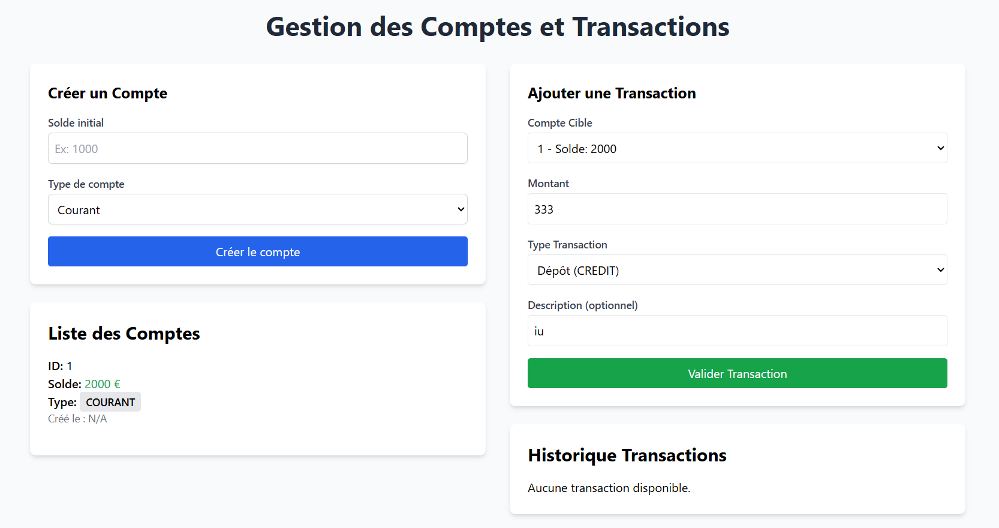
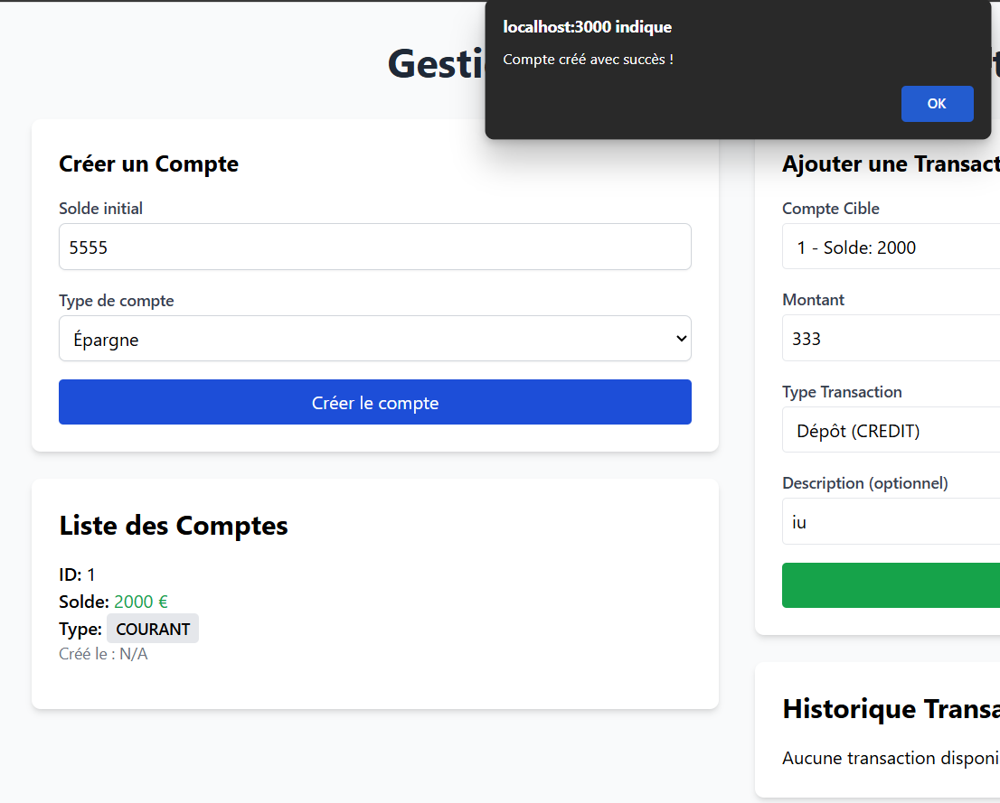

# TP 16 : Projet React avec GraphQL et Apollo Client

> **Auteur** : Ilyas MICHICH  
> **Date** : Janvier 2026  
> **Technologies** : React, GraphQL, Apollo Client

## 📖 Description

Application **React** utilisant **Apollo Client** pour consommer une API GraphQL.

## 🚀 Exécution

```bash
npm install
npm start
```

## 📸 Captures d'écran

### Interface React


### Apollo DevTools


---
*Projet réalisé par Ilyas MICHICH - Janvier 2026*
